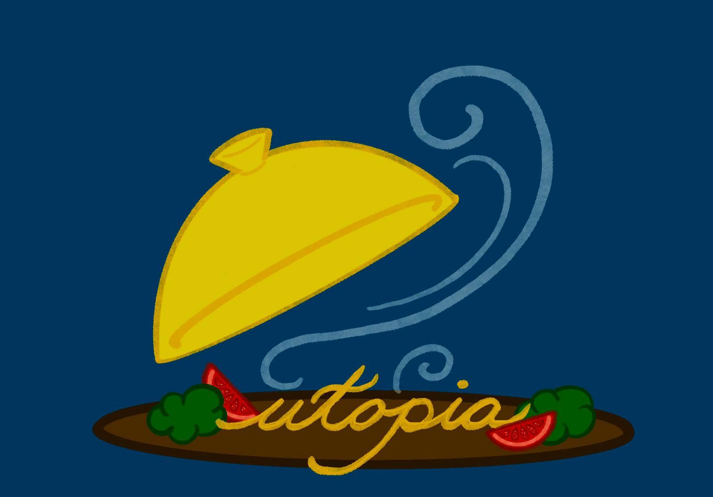
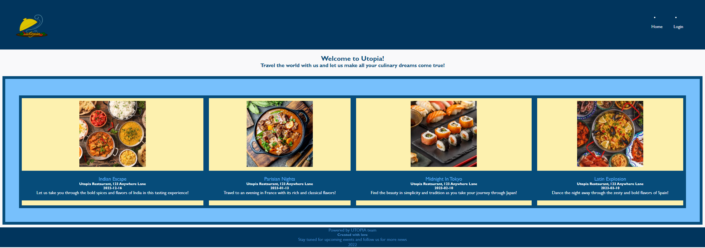
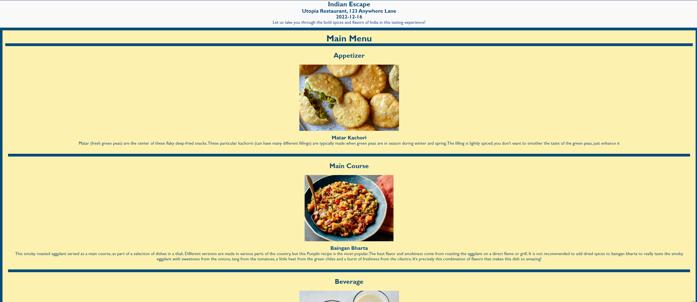
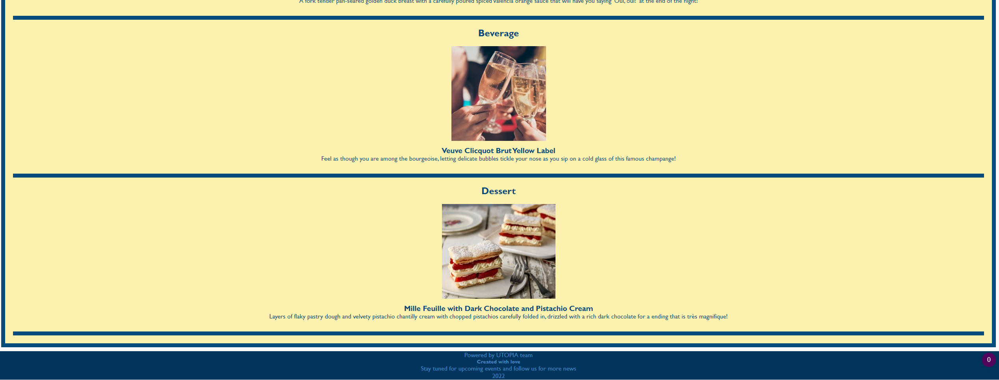
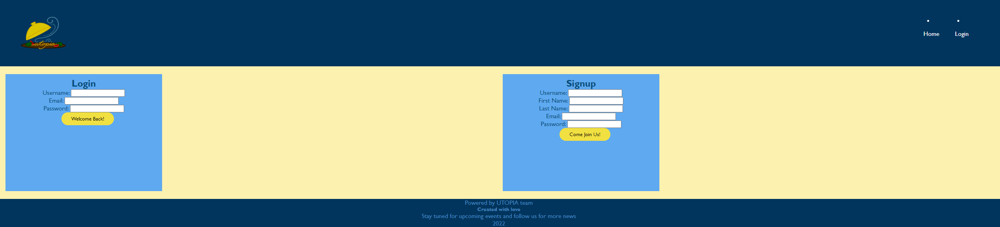

 

### Welcome to Utopia - where all your gastronomical dreams come true! 

 

 <strong><em> UTOPIA - is a full stack web application built with the best practices of RESTful APIs. UTOPIA development team is striving to deliver the highest quality user experience on a client side and the most efficient functionality on the back end of our application. As much as UTOPIA project is all about the gastronomical aesthetics of traditional cuisine from different cultures representing their authenticity and unique features, UTOPIA developers are all about implementing the most suitable technologies to cater to our customers' preferences.  </em></strong>

===========================================================================  

> ### ___For a better navigation experience please refer to the link list below:___  
- [Application Architecture](#application-architecture)
- [Functionality & walk-through](#functionality)
- [Meet the developers team](#meet-the-developers-team)
- [Sample screenshot & link to deployed application](#screenshots-and-link)
- [Reach out](#contacts)
  

> ### ___Application Architecture___

 For Utopia app we chose to design it in accordance with <strong>MVC (Model-View-Controller)</strong> pattern because it seemed to be the most suitable for our team. Since our team consists of four developers MVC pattern allowed us distribute responsibilities and work independently within our own scope. MVC model also let us divide the application in multiple development sectors and envision what the final result should be. 

Please refer to the following resources in this repository 
[Models](./models/) --- [Views](./views/) --- [Controllers](./controller/)  
[Front-end](./public/) --- [Database](./db/) --- [Seeds](./seeds/)
  

> ### ___Functionality___

 In this section we will briefly go over the functionality of the app and the development process

>> #### The Backend

  

- <strong> to sign up </strong>, you will need to fill out the form with the following information: first name, last name, username, email, password.  
After that, front end Javascript will capture this data and perform a fetch() request with a POST method to /api/users endpoint. Once the information about a new user is added to the database - a new session will be saved with user id and username to let the user freely navigate on a website. 

- <strong> to login </strong>, you will need to fill out the login form with your: username, email and password.  
lalala.....

- <strong> to RSVP for an event </strong>, the following steps are taken:  
lalala ........

  

> ### ___Meet the developers team___
<dl>
    <dt><strong>💻 Alexandria Winters <strong></dt>
    <dd>Alexandria is a creative visionary in charge of the <em>View</em> portion in MVC pattern, who implemented Handlebars.js framework in order to serve dynamic and functional HTML for the client's side........</dd>
</dl>

<dl>
    <dt><strong>💻 Valeriya Kim </strong></dt>
    <dd>Valeriya is a back-end developer behind the <em>Model & Controller</em> part of the application.....</dd>
</dl>

<dl>
    <dt><strong>💻 Bettina Staartjes  </strong></dt>
    <dd>Bettina is a design guru working her CSS magic to deliver the most <s>delicious</s> inviting user experience for our event participants......</dd>
</dl>

<dl>
    <dt><strong>💻 Matthew Parness  </strong></dt>
    <dd>Matt is a Javascript developer working on the front-end of our app to ensure the accessible functionality for the users......</dd>
</dl>
  

> ### ___Screenshots and Link___

Here you can see a few screenshots from our web application, such as: 

<strong> HOMEPAGE: </strong> 
 
<strong> EVENT PAGE: </strong> 
 
 
<strong> LOGIN/SIGNUP PAGE: </strong> 
 

<strong> UTOPIA app is deployed through Heroku and can be found <em>[right here](heroku link) </em> </strong>
  
> ### ___Contacts___

 This is the first official release of Utopia web application. Please stay tuned for Utopia 2.0 and if you have any suggestions in regards to improving app performance or if you would like to collaborate, feel free to find us on GitHub or LinkedIn:

| 🔧 Developer  | 🔗 GitHub                                                 | 🔗 LinkedIn                                  |
|:--------------:|:---------------------------------------------------------:|:-----------------------------------------:|
| Alexandria     | [awinters81](https://github.com/awinters81)               | [Alexandria Winters](https://www.linkedin.com/in/alexandria-winters-98199a23a/)
| Valeriya       | [valkim55](https://github.com/valkim55)                   | [Valeriya Kim](https://www.linkedin.com/in/valeriya-kim-763572204/)
| Bettina        | [bettinastaartjes](https://github.com/bettinastaartjes)   | [Bettina Staartjes](https://www.linkedin.com/in/bettinastaartjes/)
| Matthew        | [P1100s7](https://github.com/P1100s7)                     | [Matthew Parness](https://www.linkedin.com/in/matthew-parness)

### Thank you for visiting!